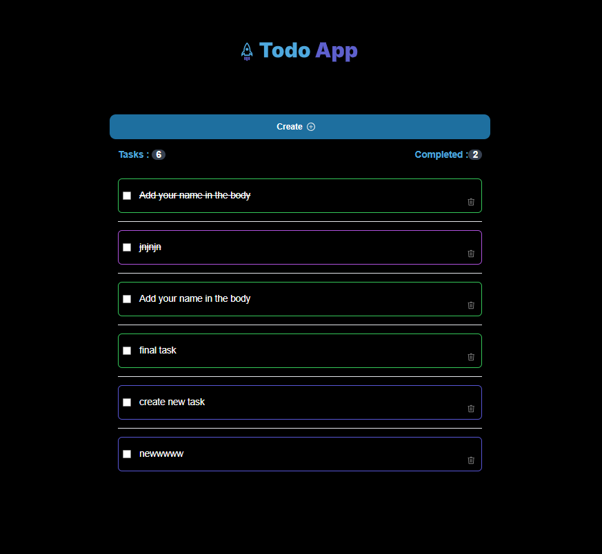
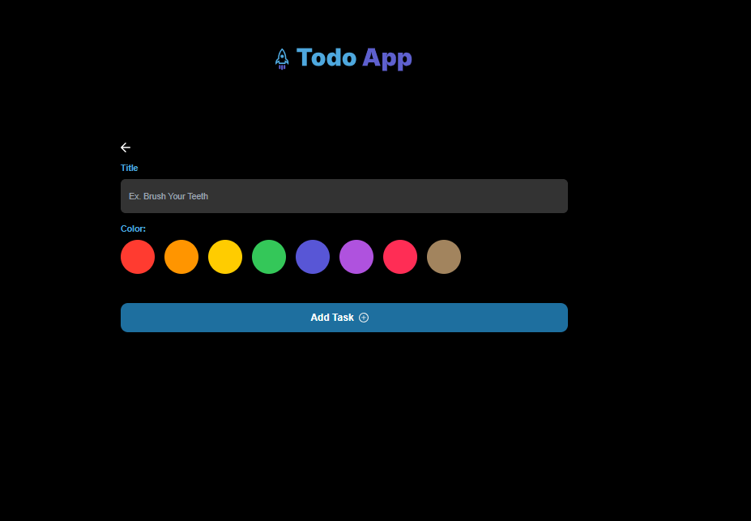

# Todo Tasks list

## Stack
- **Node Version**: 18.20.4
- **Framework**:  Next.js
- **Library**: React

## Build
To create the build run = npm run build

## Run the project
To run the project, use command = npm run dev

## Snapshots

